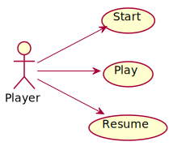
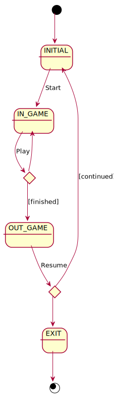
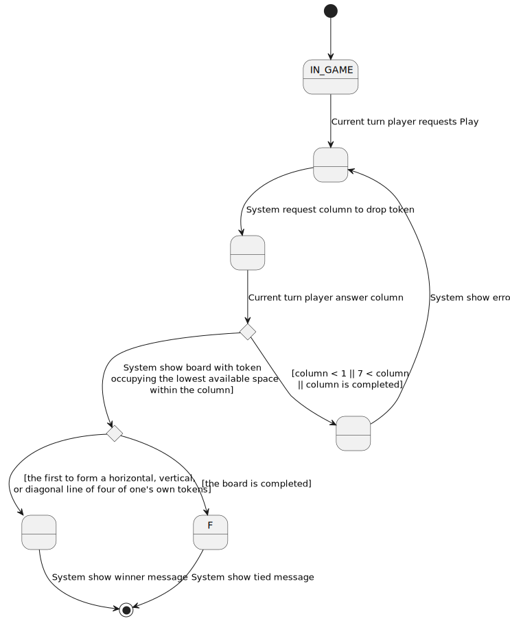
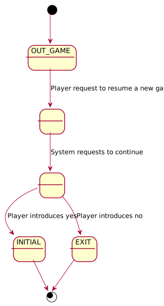

# 1-basic
Universo Santa Tecla  
[uSantaTecla@gmail.com](mailto:uSantaTecla@gmail.com)  
  
* _functionality: **basic**_
* _interface: **console**_
* _distribution: **standalone**_
* _persistence: **not**_

## useCaseView 

### 1-useCases 



### 2-context 



### 3-useCasesSpecifications

#### start  


#### play  



#### resume  



### 4-interfacePrototype

```
--- CONNECT 4 ---
-----------------------------
|   |   |   |   |   |   |   |
|   |   |   |   |   |   |   |
|   |   |   |   |   |   |   |
|   |   |   |   |   |   |   |
|   |   |   |   |   |   |   |
|   |   |   |   |   |   |   |
-----------------------------
Turn: RED
Enter a column to drop a token: 0
Invalid columnn!!! Values [1-7]
Turn: RED
Enter a column to drop a token: 8
Invalid columnn!!! Values [1-7]
Turn: RED
Enter a column to drop a token: 1
-----------------------------
|   |   |   |   |   |   |   |
|   |   |   |   |   |   |   |
|   |   |   |   |   |   |   |
|   |   |   |   |   |   |   |
|   |   |   |   |   |   |   |
| R |   |   |   |   |   |   |
-----------------------------
Turn: YELLOW
Enter a column to drop a token: 1 
-----------------------------
|   |   |   |   |   |   |   |
|   |   |   |   |   |   |   |
|   |   |   |   |   |   |   |
|   |   |   |   |   |   |   |
| Y |   |   |   |   |   |   |
| R |   |   |   |   |   |   |
-----------------------------
Turn: RED
Enter a column to drop a token: 1
-----------------------------
|   |   |   |   |   |   |   |
|   |   |   |   |   |   |   |
|   |   |   |   |   |   |   |
| R |   |   |   |   |   |   |
| Y |   |   |   |   |   |   |
| R |   |   |   |   |   |   |
-----------------------------
Turn: YELLOW
Enter a column to drop a token: 1
-----------------------------
|   |   |   |   |   |   |   |
|   |   |   |   |   |   |   |
| Y |   |   |   |   |   |   |
| R |   |   |   |   |   |   |
| Y |   |   |   |   |   |   |
| R |   |   |   |   |   |   |
-----------------------------
Turn: RED
Enter a column to drop a token: 1
-----------------------------
|   |   |   |   |   |   |   |
| R |   |   |   |   |   |   |
| Y |   |   |   |   |   |   |
| R |   |   |   |   |   |   |
| Y |   |   |   |   |   |   |
| R |   |   |   |   |   |   |
-----------------------------
Turn: YELLOW
Enter a column to drop a token: 1
-----------------------------
| Y |   |   |   |   |   |   |
| R |   |   |   |   |   |   |
| Y |   |   |   |   |   |   |
| R |   |   |   |   |   |   |
| Y |   |   |   |   |   |   |
| R |   |   |   |   |   |   |
-----------------------------
Turn: RED
Enter a column to drop a token: 1
Invalid column!!! It's completed
Turn: RED
Enter a column to drop a token: 2
-----------------------------
| Y |   |   |   |   |   |   |
| R |   |   |   |   |   |   |
| Y |   |   |   |   |   |   |
| R |   |   |   |   |   |   |
| Y |   |   |   |   |   |   |
| R | R |   |   |   |   |   |
-----------------------------
Turn: YELLOW
Enter a column to drop a token: 2
-----------------------------
| Y |   |   |   |   |   |   |
| R |   |   |   |   |   |   |
| Y |   |   |   |   |   |   |
| R |   |   |   |   |   |   |
| Y | Y |   |   |   |   |   |
| R | R |   |   |   |   |   |
-----------------------------
Turn: RED
Enter a column to drop a token: 3
-----------------------------
| Y |   |   |   |   |   |   |
| R |   |   |   |   |   |   |
| Y |   |   |   |   |   |   |
| R |   |   |   |   |   |   |
| Y | Y |   |   |   |   |   |
| R | R | R |   |   |   |   |
-----------------------------
Turn: YELLOW
Enter a column to drop a token: 3
-----------------------------
| Y |   |   |   |   |   |   |
| R |   |   |   |   |   |   |
| Y |   |   |   |   |   |   |
| R |   |   |   |   |   |   |
| Y | Y | Y |   |   |   |   |
| R | R | R |   |   |   |   |
-----------------------------
Turn: RED
Enter a column to drop a token: 4
-----------------------------
| Y |   |   |   |   |   |   |
| R |   |   |   |   |   |   |
| Y |   |   |   |   |   |   |
| R |   |   |   |   |   |   |
| Y | Y | Y |   |   |   |   |
| R | R | R | R |   |   |   |
-----------------------------
REDS WIN!!! :-)
Do you want to continue? (y/n): y
--- CONNECT 4 ---
-----------------------------
|   |   |   |   |   |   |   |
|   |   |   |   |   |   |   |
|   |   |   |   |   |   |   |
|   |   |   |   |   |   |   |
|   |   |   |   |   |   |   |
|   |   |   |   |   |   |   |
-----------------------------
Turn: RED
Enter a column to drop a token: 1
-----------------------------
|   |   |   |   |   |   |   |
|   |   |   |   |   |   |   |
|   |   |   |   |   |   |   |
|   |   |   |   |   |   |   |
|   |   |   |   |   |   |   |
| R |   |   |   |   |   |   |
-----------------------------
...
Turn: RED
Enter a column to drop a token: 6
-----------------------------
| Y | Y | Y | R | R |   | R |
| R | R | R | Y | Y | R | Y |
| Y | Y | Y | R | R | Y | R |
| R | R | R | Y | Y | R | Y |
| Y | Y | Y | R | R | Y | R |
| R | R | R | Y | Y | R | Y |
-----------------------------
Turn: YELLOW
Enter a column to drop a token: 6
-----------------------------
| Y | Y | Y | R | R | Y | R |
| R | R | R | Y | Y | R | Y |
| Y | Y | Y | R | R | Y | R |
| R | R | R | Y | Y | R | Y |
| Y | Y | Y | R | R | Y | R |
| R | R | R | Y | Y | R | Y |
-----------------------------
TIED!!!
Do you want to continue? (y/n):n

```
