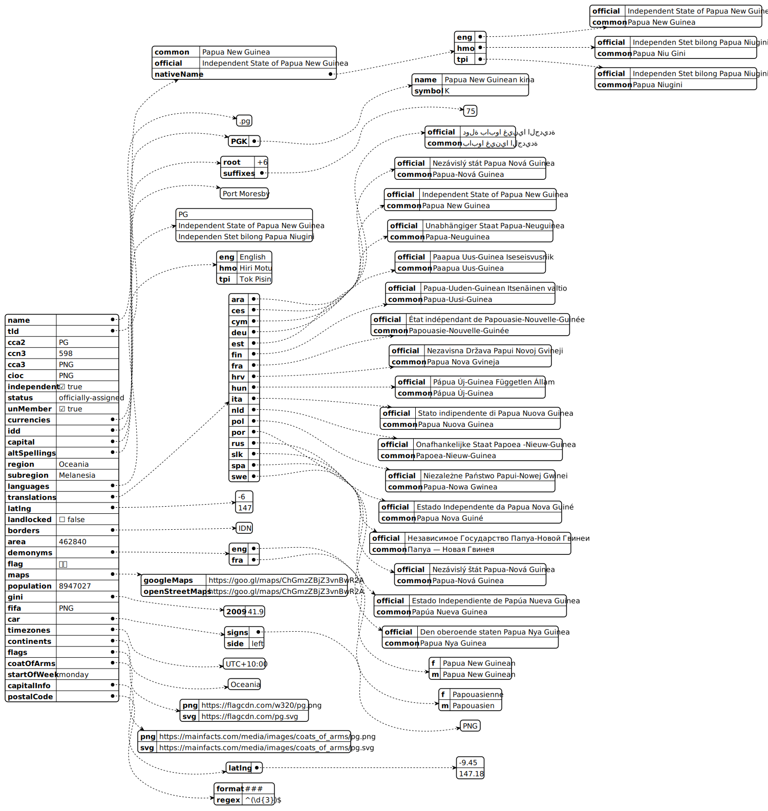

# 2-data
Universo Santa Tecla  
[uSantaTecla@gmail.com](mailto:uSantaTecla@gmail.com)  
  
* Modelar de dos formas alternativas mediante un lenguaje de datos (xml, json, yaml, ...) la información de la historia de una partida ... 
** No hace falta completar toda la historia para todos los movimientos
  

